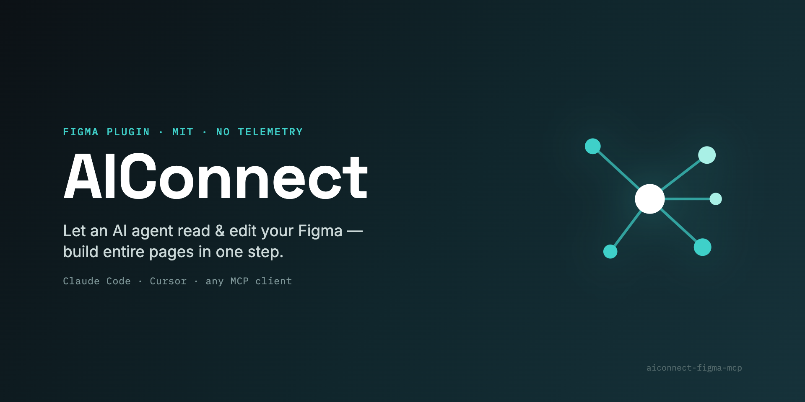

<div align="center">


# AIConnect for Figma

**Drive Figma from any AI agent — build entire pages in one call.**
Open-source · fully local · works with Claude Code, Cursor, or any MCP client.

[](./LICENSE)
[](#-license--commercial-use)
[](https://modelcontextprotocol.io)
[](#)
[](#contributing)
[](https://github.com/guptaprakhariitr/aiconnect-figma-mcp)



</div>

AIConnect is an **MCP (Model Context Protocol) server + Figma plugin** that lets an AI
agent read and edit a live Figma file — create frames, text, auto‑layout, fills,
gradients, effects and SVGs, import images, clone nodes, and **assemble whole pages in a
single round‑trip** with `batch_ops`. It runs entirely on your machine.

> ⭐ If this saves you time, a star helps other people find it.

---

## ✨ See it in action

> An AI agent designing a full landing page in Figma, live, through AIConnect:

<!-- SCREENSHOT:OUTPUT -->

---

## Why AIConnect

| | |
|---|---|
| 🔒 **Local & private** | Talks only to a relay on `localhost`. No telemetry, no third‑party servers, nothing leaves your machine. |
| 🤝 **Client‑agnostic** | Use it with Claude Code, Cursor, or any MCP client — not tied to one editor. |
| ⚡ **`batch_ops`** | Build an entire page/section in **one** round‑trip instead of 100+ individual calls. |
| 🎨 **Rich commands** | Images, fonts, gradients, effects, SVG, auto‑layout, clone, reorder — ~45 tools. |
| 🛠️ **Open & hackable** | AGPL‑3.0, ~one file to extend. Wire it into your own agent skills. |

> **Note on Figma's official MCP.** Figma now ships a first‑party MCP (`use_figma`).
> AIConnect is an **independent, open‑source, local** alternative — client‑agnostic,
> scriptable, and built around the one‑round‑trip `batch_ops` for fast page building. Use
> whichever fits your workflow, or both.

---

## 🚀 Quickstart (~2 minutes)

**Prerequisites:** [Bun](https://bun.sh) and the Figma desktop app.

### 1 · Install & build

```bash
git clone https://github.com/guptaprakhariitr/aiconnect-figma-mcp
cd aiconnect-figma-mcp
bun install && bun run build
```

### 2 · Start the local relay (leave running)

```bash
bun socket          # → WebSocket server running on port 3055
```

### 3 · Import the plugin into Figma

In Figma desktop: **Plugins → Development → Import plugin from manifest…** and choose
`src/figma_plugin/manifest.json`.

<!-- SCREENSHOT:IMPORT -->

### 4 · Run the plugin & copy the channel

Run **Plugins → Development → AIConnect for Figma**. The plugin connects and shows a
**channel id** — copy it.

<!-- SCREENSHOT:PLUGIN -->

### 5 · Point your agent at the MCP server

Add this to your MCP client config (`.mcp.json` for Claude Code, `mcp.json` for Cursor) —
or just run `bun setup` to write it for you:

```json
{
  "mcpServers": {
    "AIConnect": {
      "command": "bun",
      "args": ["run", "/absolute/path/to/aiconnect-figma-mcp/dist/server.js"]
    }
  }
}
```

### 6 · Connect and build

In your agent, call **`join_channel`** with the id from the plugin, then ask it to design.
That's it. 🎉

> 💡 Keep the Figma window focused while the agent works — Figma pauses background plugins
> (which shows up as command timeouts).

---

## ⚡ `batch_ops` — build pages in one call

The headline feature. Children reference parents created earlier in the same batch via
`@ref` placeholders, so a whole layout goes over the wire once:

```jsonc
batch_ops({
  ops: [
    { "ref": "page", "command": "create_frame",
      "params": { "x": 0, "y": 0, "width": 1440, "height": 800, "name": "Landing",
                  "layoutMode": "VERTICAL", "fillColor": { "r": 0.98, "g": 0.96, "b": 0.92 } } },
    { "command": "set_layout_sizing", "params": { "nodeId": "@page", "layoutSizingVertical": "HUG" } },
    { "ref": "title", "command": "create_text",
      "params": { "text": "Hello", "fontSize": 56, "parentId": "@page" } },
    { "command": "set_font_name", "params": { "nodeId": "@title", "family": "Inter", "style": "Bold" } }
  ]
})
// → { ok: true, ids: { page: "12:3", title: "12:4" }, errors: [] }
```

- `@ref` resolves anywhere a node id is expected (incl. nested objects/arrays).
- Ops run **sequentially** in the plugin — no parallel‑crash risk.
- Returns a compact `ids` + `errors` map, not a verbose node dump.
- `set_image_fill` works in a batch too — the server pre‑encodes `imagePath`/`imageUrl`.

---

## 🧰 Tools

<details>
<summary><b>~45 commands across reads, create/edit, style, layout & batch</b></summary>

**Reads** — `get_document_info`, `get_selection`, `get_node_info`, `get_nodes_info`, `read_my_design`, `scan_text_nodes`, `scan_nodes_by_types`, `get_styles`, `get_local_components`, `get_annotations`, `get_reactions`, `export_node_as_image`

**Create / edit** — `create_frame`, `create_text`, `create_rectangle`, `create_ellipse`, `create_svg`, `create_component_instance`, `clone_node`, `insert_child`, `move_node`, `resize_node`, `delete_node`, `delete_multiple_nodes`

**Style** — `set_fill_color`, `set_stroke_color`, `set_gradient_fill`, `set_effect`, `set_corner_radius`, `set_image_fill`, `set_font_name`, `set_text_content`, `set_multiple_text_contents`

**Layout** — `set_layout_mode`, `set_layout_sizing`, `set_padding`, `set_item_spacing`, `set_axis_align`

**Batch & misc** — `batch_ops`, `join_channel`, annotations, connectors, focus/selection helpers

</details>

---

## 🏗️ How it works

```
AI agent (MCP client)
        │  MCP (stdio)
        ▼
  MCP server  ──┐
                │  WebSocket  ws://localhost:3055
  Figma plugin ─┘   (the relay / socket server)
        │  Plugin API
        ▼
   Your Figma file
```

The **MCP server** (`src/aiconnect_mcp/server.ts`) exposes tools; the **relay**
(`src/socket.ts`) brokers messages on port 3055; the **plugin** (`src/figma_plugin/`) runs
inside Figma. The agent and plugin join the same **channel**.

---

## 🧪 Testing

```bash
bun test               # connection-free: every MCP command has a matching plugin handler
bun test:smoke <chan>  # live: drives the plugin through batch_ops + ~18 commands
```

---

## ❓ FAQ

**How is this different from Figma's official MCP?** AIConnect is open‑source, runs fully
locally, works with any MCP client, and centers on `batch_ops` for fast multi‑node builds.

**Is my data safe?** Yes — the plugin's only network use is `ws://localhost:3055` on your
own machine. No telemetry, no external calls.

**Which agents work?** Anything that speaks MCP — Claude Code, Cursor, and others.

**Why do commands sometimes time out?** Figma pauses plugins whose window isn't focused.
Keep Figma in front while the agent works.

---

## 🤝 Contributing

PRs welcome. By contributing you agree your contribution may also be offered under the
commercial license (see below). Run `bun test` before opening a PR.

---

## 📄 License & commercial use

AIConnect is licensed under the **GNU AGPL‑3.0** (see [LICENSE](./LICENSE)). You may use,
modify, and self‑host it freely; if you run a modified version as a network service, the
AGPL requires you to release your source under the same license.

**Want to use AIConnect in a closed‑source product or hosted service without AGPL
obligations?** A separate commercial license is available — **prakshatechnologies@gmail.com**.

Builds on prior MIT‑licensed work — see [NOTICE](./NOTICE).
