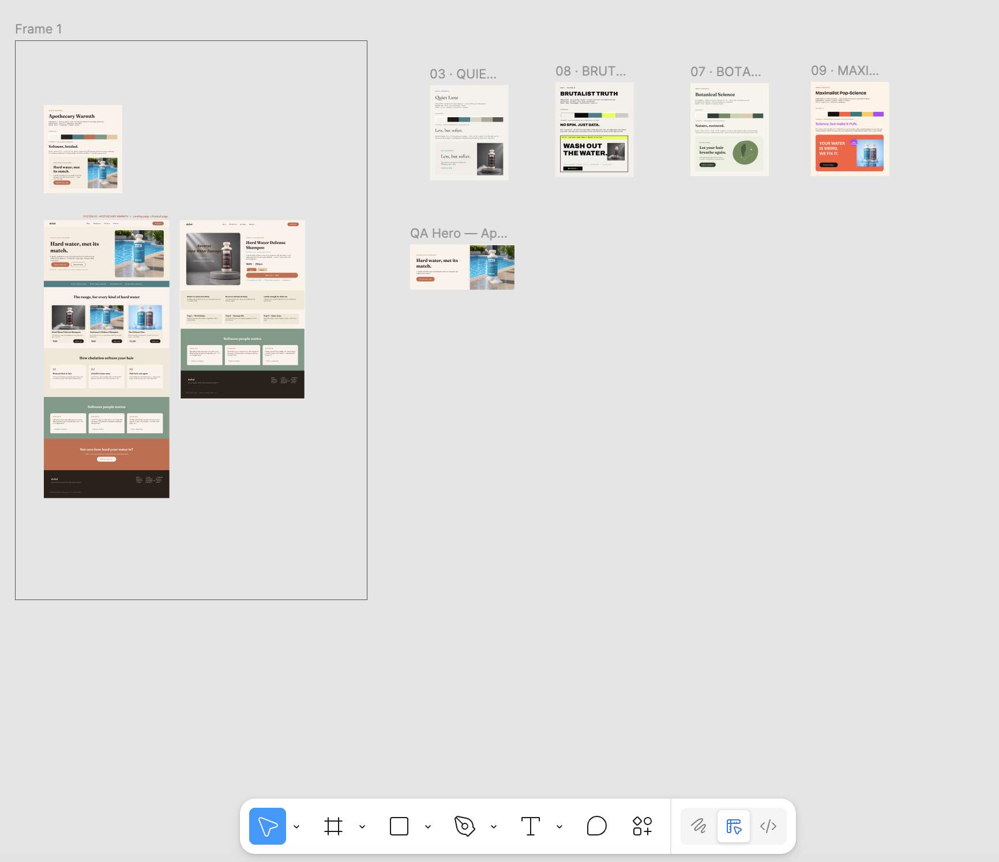
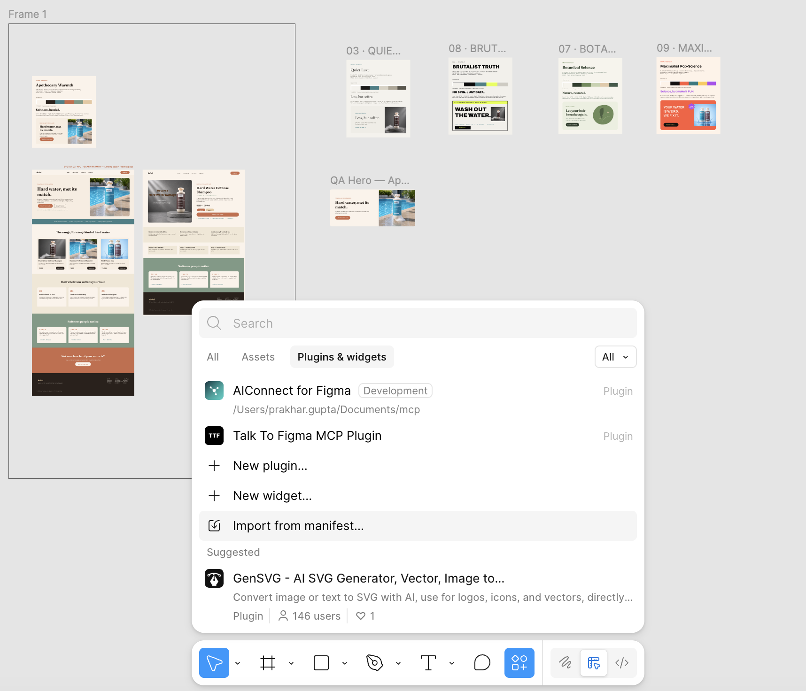
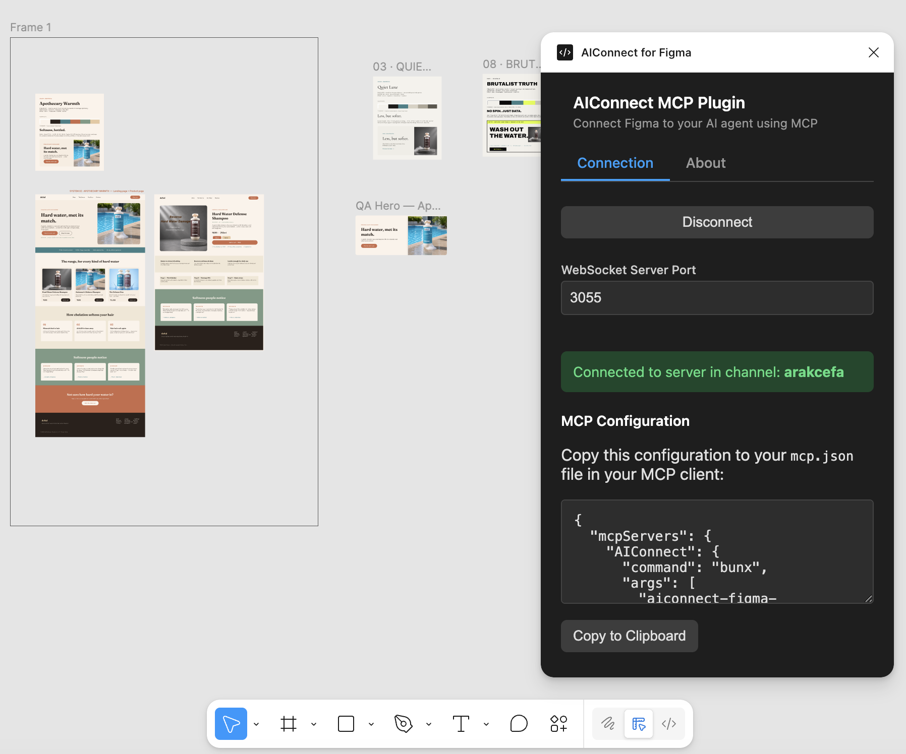

<div align="center">


# AIConnect for Figma

### Your AI agent, designing in your real Figma file — 100% local, whole pages in one call.

Open-source · fully local · no cloud, no telemetry · works with Claude Code, Cursor, or any MCP client.

[](https://www.npmjs.com/package/aiconnect-figma-mcp)
[](./LICENSE)
[](#-license)
[](https://modelcontextprotocol.io)
[](#why-aiconnect)
[](#)
[](#-contributing)
[](https://github.com/guptaprakhariitr/aiconnect-figma-mcp)


</div>

**AIConnect is an MCP server + Figma plugin that hands your AI agent a real pen in your real Figma file.** It creates frames, text, auto‑layout, fills, gradients, effects, SVGs, imports images, clones nodes, builds a full design‑token system, and **assembles entire pages in one round‑trip** with `batch_ops`. Everything runs on your machine and talks only to a relay on `localhost` — **no cloud, no telemetry, nothing leaves your laptop.**

> ⭐ If this saves you time, a star helps other people find it.

---

## ✨ See it in action

> No hand‑placed layers. An agent was asked to design a hard‑water hair‑care brand and built it all **directly in Figma** through AIConnect — a landing page, a product page, and four full design‑direction boards, each assembled with `batch_ops`.

<div align="center">

</div>

---

## 🔓 What AIConnect unlocks for free

Most of these are behind a paid Figma seat or a paid plugin. With AIConnect they're just MCP tools your agent can call — **keyless and local**.

| You'd normally pay for… | AIConnect gives you | Tool(s) |
|---|---|---|
| **Dev Mode** inspect / CSS handoff (paid Dev seat) | Dev Mode‑equivalent CSS for any node — no Dev seat | `get_css` |
| **Variables / design tokens** workflow (Dev Mode, Enterprise) | First‑class variables you can create, bind, and export to DTCG / CSS / Tailwind | `create_variable`, `bind_variable`, `export_tokens` |
| **Palette / brand** generator plugins | Full token system (OKLCH ramps, semantic roles, type scale) from a preset, brand name, or one color | `apply_brand`, `generate_palette`, `generate_theme` |
| **Stock photo & icon** plugins | 200k+ Iconify icons and openly‑licensed Openverse imagery, inserted in place | `insert_icon`, `search_icons`, `search_images` |
| **Font‑pairing** plugins | Typeface pairing recommendations | `suggest_fonts` |
| **Accessibility / contrast** plugins | WCAG contrast checks with auto‑fix suggestions | `check_contrast` |

---

## Why AIConnect

|  |  |
|---|---|
| 🔒 **Local & private** | Talks only to a relay on `localhost`. No telemetry, no third‑party servers — nothing leaves your machine. |
| 🤝 **Client‑agnostic** | Use it with Claude Code, Cursor, or any MCP client — not tied to one editor. |
| ⚡ **`batch_ops`** | Build a whole page/section in **one** round‑trip instead of 100+ individual calls. |
| 🎨 **Rich commands** | Images, fonts, gradients, effects, SVG, auto‑layout, clone, reorder — **67 tools**. |
| 🎯 **Design intelligence** | Keyless & local: `apply_brand` (full token systems from a preset/brand/color), OKLCH `generate_palette`/`generate_theme`, WCAG `check_contrast` (+auto‑fix), `suggest_fonts`, 200k+ `insert_icon` (Iconify), `search_images` (Openverse). |
| 🎟️ **Design tokens & Dev Mode** | First‑class Figma variables (`create_variable`, `bind_variable`, `export_tokens`), plus `get_css` — Dev Mode‑equivalent inspect **without a paid Dev seat**. |
| 🔍 **Debuggable** | `get_status`, `get_console_logs`, and `get_page_snapshot` — the agent literally sees its work and self-corrects. |
| 🛠️ **Open & hackable** | AGPL‑3.0, ~one file to extend. Wire it into your own agent skills. |

---

## ⚡ 2‑minute quickstart

**Prerequisites:** [Node ≥ 18](https://nodejs.org) (or [Bun](https://bun.sh)) and the **[Figma desktop app](https://www.figma.com/downloads/)** (free). The browser version of Figma **cannot import development plugins**, so the desktop app is required.

### 1 · Point your agent at the MCP server

No clone, no build — `npx` fetches and runs the published server. Add this to your MCP client config (`.mcp.json` for Claude Code, `mcp.json` for Cursor):

```jsonc
{
  "mcpServers": {
    "AIConnect": {
      "command": "npx",
      "args": ["-y", "aiconnect-figma-mcp"]
    }
  }
}
```

### 2 · Start the local relay — leave it running

```bash
npx -y aiconnect-figma-relay     # → relay running on ws://localhost:3055
```

The relay runs on plain **Node** — no Bun required.

### 3 · Import the plugin into Figma

The plugin ships inside the npm package. After step 1, print its path with:

```bash
node -e "console.log(require.resolve('aiconnect-figma-mcp/src/figma_plugin/manifest.json'))"
```

Then in the **Figma desktop app** (not the browser): actions menu (or **right‑click → Plugins**) → **Development → Import plugin from manifest…** and choose that `manifest.json`.

<div align="center">

</div>

### 4 · Run the plugin & copy the channel

Run **Plugins → Development → AIConnect for Figma**. The panel connects to the relay and shows a **channel id** — copy it.

<div align="center">

</div>

### 5 · Connect and build

In your agent, call **`join_channel`** with the id from the plugin, then ask it to design. That's it. 🎉

> 💡 Keep the Figma window **focused** while the agent works — Figma pauses background plugins, which surfaces as command timeouts.

<details>
<summary><b>Prefer to run from source? (Bun dev path)</b></summary>

<br/>

```bash
git clone https://github.com/guptaprakhariitr/aiconnect-figma-mcp
cd aiconnect-figma-mcp
bun run setup        # installs, builds, writes a correctly-pathed .mcp.json,
                     # and prints the plugin-import + channel steps
bun run relay        # in a second terminal — or: bun socket (Bun-native)
```

Then point your agent at the absolute `dist/server.js` path that `setup` printed, import [`src/figma_plugin/manifest.json`](src/figma_plugin/manifest.json), and join the channel.

</details>

---

## 💬 Try these prompts

Once your agent has joined the channel, paste any of these:

```text
Apply the "fintech-trust" brand, then build a pricing page with 3 tiers
(Starter / Pro / Enterprise), a feature list per tier, and a highlighted
"most popular" middle card. Use batch_ops so it's one round-trip.
```

```text
Generate an OKLCH theme from the seed color #5B8DEF, create Figma variables
for it, bind them to a hero section you build, then export the tokens as
Tailwind config.
```

```text
Inspect my selected card with get_css and tell me the exact CSS. Then check
the text contrast against its background and auto-fix anything that fails WCAG AA.
```

```text
Build a 4-feature "Why us" section: each feature is an Iconify icon
(insert_icon), a heading, and a line of body text, in a responsive
auto-layout row. Suggest a font pairing first and apply it.
```

---

## ⚡ `batch_ops` — build pages in one call

The headline feature. Children reference parents created earlier in the **same** batch via `@ref` placeholders, so a whole layout goes over the wire once:

```jsonc
batch_ops({
  ops: [
    { "ref": "page", "command": "create_frame",
      "params": { "x": 0, "y": 0, "width": 1440, "height": 800, "name": "Landing",
                  "layoutMode": "VERTICAL", "fillColor": { "r": 0.98, "g": 0.96, "b": 0.92 } } },
    { "command": "set_layout_sizing", "params": { "nodeId": "@page", "layoutSizingVertical": "HUG" } },
    { "ref": "title", "command": "create_text",
      "params": { "text": "Hello", "fontSize": 56, "parentId": "@page" } },
    { "command": "set_font_name", "params": { "nodeId": "@title", "family": "Inter", "style": "Bold" } }
  ]
})
// → { ok: true, ids: { page: "12:3", title: "12:4" }, errors: [] }
```

- `@ref` resolves anywhere a node id is expected (including nested objects/arrays).
- Ops run **sequentially** in the plugin — no parallel‑crash risk.
- Returns a compact `ids` + `errors` map, not a verbose node dump.
- `set_image_fill` works in a batch too — the server pre‑encodes `imagePath` / `imageUrl`.

---

## 🧰 Tools

<details>
<summary><b>67 tools across reads, create/edit, style, layout, batch, tokens, debug &amp; design intelligence</b></summary>

<br/>

**Reads** — `get_document_info`, `get_selection`, `get_node_info`, `get_nodes_info`, `read_my_design`, `scan_text_nodes`, `scan_nodes_by_types`, `get_styles`, `get_local_components`, `get_annotations`, `get_reactions`, `export_node_as_image`

**Create / edit** — `create_frame`, `create_text`, `create_rectangle`, `create_ellipse`, `create_svg`, `create_component_instance`, `clone_node`, `insert_child`, `move_node`, `resize_node`, `delete_node`, `delete_multiple_nodes`

**Style** — `set_fill_color`, `set_stroke_color`, `set_gradient_fill`, `set_effect`, `set_corner_radius`, `set_image_fill`, `set_font_name`, `set_text_content`, `set_multiple_text_contents`

**Layout** — `set_layout_mode`, `set_layout_sizing`, `set_padding`, `set_item_spacing`, `set_axis_align`

**Design tokens / variables** — `get_variables`, `create_variable_collection`, `create_variable`, `set_variable_value`, `bind_variable`, `export_tokens` (DTCG/CSS/Tailwind)

**Dev & debug** — `get_css` (Dev Mode‑equivalent, no paid seat), `get_status`, `get_console_logs`, `get_page_snapshot`

**Design intelligence** (keyless, local) — `apply_brand`, `list_brand_presets`, `generate_palette`, `generate_theme`, `check_contrast`, `suggest_fonts`, `search_icons`, `insert_icon`, `search_images`

**Batch & misc** — `batch_ops`, `join_channel`, annotations, connectors, focus/selection helpers

</details>

---

## 🏗️ How it works

```
AI agent (MCP client)
        │  MCP (stdio)
        ▼
  MCP server  ──┐
                │  WebSocket  ws://localhost:3055
  Figma plugin ─┘   (the relay / socket server)
        │  Plugin API
        ▼
   Your Figma file
```

The **MCP server** ([`src/aiconnect_mcp/server.ts`](src/aiconnect_mcp/server.ts)) exposes the tools and runs under plain Node; the **relay** brokers messages on port 3055 — run it under Node via [`scripts/relay.mjs`](scripts/relay.mjs) (`aiconnect-figma-relay`) or under Bun via [`src/socket.ts`](src/socket.ts) (`bun socket`); the **plugin** ([`src/figma_plugin/`](src/figma_plugin/)) runs inside Figma. The agent and the plugin join the same **channel**.

---

## 🧪 Testing

```bash
bun run test               # connection-free: every MCP command has a matching plugin handler
bun run test:smoke <chan>  # live: drives the plugin through batch_ops + ~18 commands
```

> ℹ️ Use `bun run test` (not `bun test`) — bare `bun test` invokes Bun's built‑in test runner, which finds no spec files here.

---

## ❓ FAQ

**What makes AIConnect special?**
It's open‑source, runs fully locally, works with any MCP client, and centers on `batch_ops` for fast multi‑node builds — plus a keyless design‑intelligence layer (brand kits, palettes, contrast, fonts, icons, images) so your agent designs with taste, not guesses.

**Is my data safe?**
Yes. The plugin's only network use is `ws://localhost:3055` on your own machine. No telemetry, no external calls.

**Which agents work?**
Anything that speaks MCP — Claude Code, Cursor, and others.

**Why do commands sometimes time out?**
Figma pauses plugins whose window isn't focused. Keep Figma in front while the agent works.

---

## 🤝 Contributing

PRs welcome. Run `bun run test` before opening a PR.

---

## 📄 License

**Free for everyone — individuals and teams alike. No seat limits, no usage caps, no paywalls, no restrictions.** Use it at work or at home, on as many machines and projects as you like, forever.

AIConnect is open source under the **GNU AGPL‑3.0** (see [LICENSE](./LICENSE)) — you're free to use, modify, and self‑host it. The only ask: if you distribute a modified version or run one as a public network service, share your changes under the same license. That's it.

Builds on prior MIT‑licensed work — see [NOTICE](./NOTICE).
